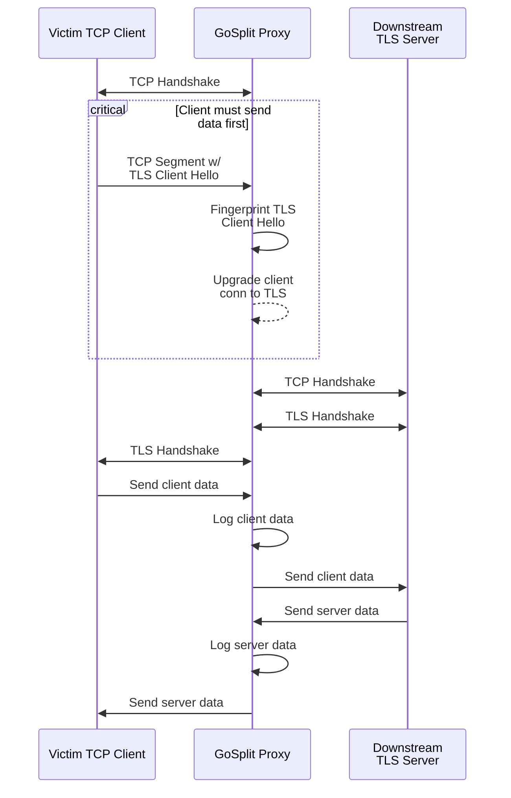

GoStrip is a simple TLS-aware TCP proxy that can be used
to extract cleartext data from a TLS tunnels.

# Limitations

- As SSL has been deprecated in Go's crypto library, only TLS is 
  currently supported
- A static PEM certificate is used for all connections
  - Support for dynamically generated and cached certificates
    may be implemented in the future
- The client is presumed to send data first, and that first
  transmission should contain a TLS handshake
  - This breaks protocols where the TLS tunnel is negotiated
    during later stages of communication, like STARTTLS
  - Protocols expecting the server to send the initial data
    will result in the connection blocking until timeout

# How it Works

GoSplit checks the bytes of each initial client TCP segment to determine
if the connection should be upgraded to TLS. Data extracted from
connections are base64 encoded and logged to disk in [JSONL format][jsonl].

The following sequence diagram roughly illustrates the connection splitting
process.

[jsonl]: https://jsonlines.org/

# Warning (Intended Use)

This project was developed for security research purposes (like
[eavesarp-ng]) and is highly inefficient. Don't use it in
production scenarios.

[eavesarp-ng]: https://github.com/ImpostorKeanu/eavesarp-ng

# Using in Other Go Projects

GoStrip was developed as a module so that it can be used in
any Go project. Any type that implements the [Cfg interface][cfg-interface]
can be used to run a TCP [proxy server][proxy-server], allowing
the implementor to customize everything from TLS connection
fingerprinting to handling of intercepted data.

See the [GoStrip utility][utility-cfg] for a simple example of how
the interface can be implemented.

[cfg-interface]: cfg.go
[proxy-server]: proxy.go
[utility-cfg]: cmd/cfg.go